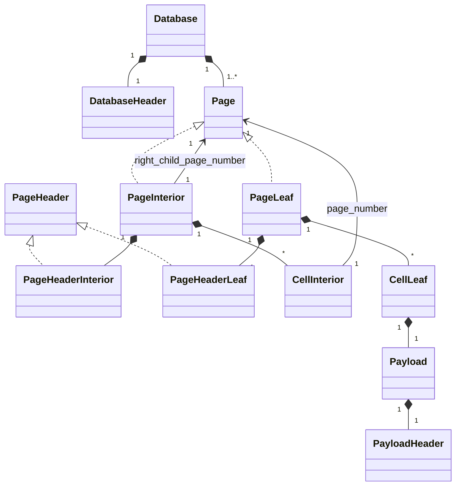

# sqlite-from-scratch
This project is my own implementation of sqlite database in Python.

## Goal of this project
Learn the structure of .db files and how the database engines works under the hood. 

Additionally, I decided to try out TDD using [Pytest](https://docs.pytest.org/en/stable/).

## Inspiration
I was inspired to make this project by [Codecrafters' tutorials](https://app.codecrafters.io/courses/sqlite/overview). I didn't use their unit tests because they're paid, however I still find it as a great roadmap to follow and learn something new!

## Quickstart
Thanks to the mentioned Pytest running tests is extremely easy.

Open terminal in an unzipped repository:

```bash
python -m venv venv
source venv/bin/activate
```

```bash
pip install pytest
```

```bash
pytest test_main.py
```

## Class Database UML



## Usefull sources
- [The best SQLite file format viewer](https://sqlite-internal.pages.dev/)
- [Chinook sqlite database](https://github.com/lerocha/chinook-database/tree/master?tab=License-1-ov-file)

## To-Do
- [REFACTORED] Print page size
- [REFACTORED] Print object names
- Count rows in a table
- Read data from a single column
- Read data from multiple columns
- Filter data with a WHERE clause
- Retrieve data using a full-table scan
- Retrieve data using an index
